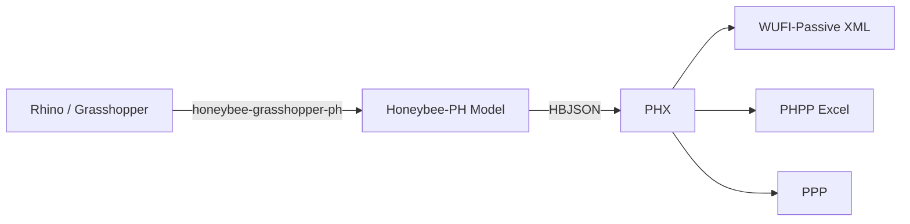

# Getting Started

PHX (Passive House Exchange) is a Python library that converts building energy model data
between [Honeybee-PH](https://github.com/PH-Tools/honeybee_ph) (HBJSON) and Passive House
formats — [WUFI-Passive](https://wufi.de/en/) XML, [PHPP](https://passivehouse.com/04_phpp/04_phpp.htm) Excel,
and PPP.

PHX models are **in-memory only** — they are never serialized directly. They serve as an
intermediate representation created from a source format and exported to a target format.

> This library is not affiliated with or created by PHI, Phius, or the WUFI development team.

## Prerequisites

PHX is designed to work as part of the [Honeybee-PH](/honeybee-ph/) workflow.
You will need:

- **Python 3.10+**
- [Honeybee-PH](https://github.com/PH-Tools/honeybee_ph) — the upstream data model that produces HBJSON files
- A target application: [WUFI-Passive](https://wufi.de/en/), [PHPP](https://passivehouse.com/04_phpp/04_phpp.htm), or both

For the full Grasshopper-based workflow, you will also need:

- [Ladybug Tools](https://www.ladybug.tools/) v1.9 or higher
- [Rhino 3D](https://www.rhino3d.com/) + Grasshopper
- [honeybee-grasshopper-ph](https://github.com/PH-Tools/honeybee_grasshopper_ph) (Grasshopper components)

## Installation

Install from PyPI:

```bash
pip install PHX
```

## Typical Workflow



1. **Model** your building geometry in Rhino and assign Passive House attributes using the
   [Grasshopper components](https://github.com/PH-Tools/honeybee_grasshopper_ph).
2. **Export** the Honeybee-PH model as an HBJSON file.
3. **Convert** the HBJSON to your target format using PHX — either via the included
   command-line scripts or programmatically.
4. **Open** the resulting file in WUFI-Passive, PHPP, or your target application.

## Links

- [Source Code (GitHub)](https://github.com/PH-Tools/PHX)
- [PyPI](https://pypi.org/project/PHX/)
- [Passive House Tools](https://www.passivehousetools.com)
