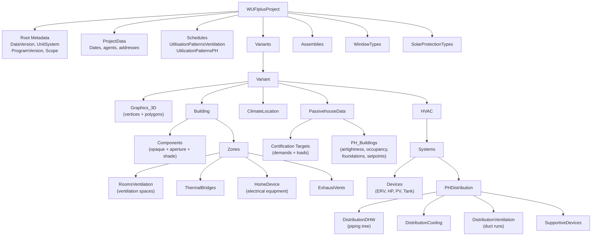

# WUFI-Passive XML Schema Reference

WUFI-Passive XML files are the primary data exchange format for Passive House energy models. They can be 30,000-100,000+ lines and contain the complete building model: geometry, constructions, windows, HVAC, DHW, renewables, and certification parameters.

---

## XML Structure Map

Format version 3.x, Data Version 48+. Section order is consistent across projects; line numbers vary by project size.

### Top-Level Overview



### Detailed Element Trees

#### Root & Project Metadata

```
WUFIplusProject
├── DataVersion (e.g. 48)
├── UnitSystem (0=SI, 1=IP)
├── ProgramVersion (e.g. "3.2.0.1")
├── Scope
├── DimensionsVisualizedGeometry
├── ProjectData
│   ├── Year_Construction
│   ├── OwnerIsClient
│   ├── Date_Project (Year, Month, Day, Hour, Minutes)
│   ├── WhiteBackgroundPictureBuilding
│   ├── Customer_{Name,Street,Locality,PostalCode,Tel,Email}
│   ├── Building_{Name,Street,Locality,PostalCode}
│   ├── Owner_{Name,Street,Locality,PostalCode}
│   └── Responsible_{Name,Street,Locality,PostalCode,Tel,LicenseNr,Email}
├── UtilisationPatternsVentilation (ventilation schedule collection)
├── UtilizationPatternsPH (occupancy schedule collection)
├── Variants (contains one or more Variant — see below)
├── Assemblies (opaque construction types — see below)
├── WindowTypes (window construction types — see below)
└── SolarProtectionTypes (shading device types)
```

!!! note "Variants wrapper"
    Building, HVAC, PassivehouseData, and ClimateLocation are all **inside** `Variants > Variant`, not at the root level. Assemblies, WindowTypes, and SolarProtectionTypes are at the root level, shared across all variants.

#### Schedules

```
UtilisationPatternsVentilation
└── UtilizationPatternVent
    ├── Name, IdentNr
    ├── OperatingDays (days/week), OperatingWeeks (weeks/year)
    ├── Maximum_DOS, Maximum_PDF (high-speed period: hours, speed fraction)
    ├── Standard_DOS, Standard_PDF
    ├── Basic_DOS, Basic_PDF
    └── Minimum_DOS, Minimum_PDF

UtilizationPatternsPH
└── UtilizationPattern
    ├── IdentNr, Name
    ├── HeightUtilizationLevel
    ├── BeginUtilization, EndUtilization (hours)
    ├── AnnualUtilizationDays
    ├── IlluminationLevel [lux]
    ├── RelativeAbsenteeism
    └── PartUseFactorPeriodForLighting
```

!!! note "Spelling"
    The ventilation schedule list uses British spelling `UtilisationPatternsVentilation` (with an 's'), while the child elements use American spelling `UtilizationPatternVent`. This is intentional and matches WUFI's own inconsistency.

#### Variant

```
Variant
├── IdentNr, Name, Remarks
├── Graphics_3D (geometry data)
│   ├── Vertices > Vertix (IdentNr, X, Y, Z)
│   └── Polygons > Polygon (IdentNr, NormalVector{X,Y,Z}, IdentNrPoints, IdentNrPolygonsInside)
├── Building
│   ├── Components (ALL opaque + aperture + shade surfaces for the building)
│   │   └── Component (see Component details below)
│   └── Zones (zone definitions)
│       └── Zone (see Zone details below)
├── ClimateLocation (see ClimateLocation below)
├── PassivehouseData (see PassivehouseData below)
└── HVAC (see HVAC below)
```

!!! warning "Components are under Building, not Zone"
    Components and Zones are **siblings** under `Building`. An LLM navigating the XML should look for `Variant > Building > Components` for surface data, and `Variant > Building > Zones` for zone-level data like thermal bridges, ventilation rooms, and electrical equipment.

#### Components (under Building)

```
Component (opaque — Type=1)
├── IdentNr, Name, Visual
├── Type (1=opaque)
├── IdentNrColorI, IdentNrColorE (interior/exterior color IDs)
├── InnerAttachment (1=zone interior, -1=not attached)
├── OuterAttachment (-1=exterior/ambient, -2=ground)
├── IdentNr_ComponentInnerSurface (-1 or zone surface ID)
├── IdentNrAssembly (links to Assembly)
├── IdentNrWindowType (-1 for opaque)
└── IdentNrPolygons (list of polygon IDs)

Component (aperture — Type=2)
├── (same base fields as opaque, but IdentNrAssembly=-1)
├── IdentNrWindowType (links to WindowType)
├── DepthWindowReveal [m]
├── DistanceDaylightOpeningToReveal [m]
├── IdentNrSolarProtection (ID ref, -1=none)
├── IdentNrOverhang (ID ref, -1=none)
└── DefaultCorrectionShadingMonth (fraction 0-1)

Component (shade surface — Type=1, special case)
├── Type=1 (same as opaque)
├── InnerAttachment=-1, OuterAttachment=-1 (neither attached)
├── IdentNrAssembly=-1 (no assembly)
└── IdentNrWindowType=-1
```

#### Zones

```
Zone
├── Name, IdentNr
├── KindZone (1=conditioned, etc.)
├── KindAttachedZone
├── TemperatureReductionFactorUserDefined
├── RoomsVentilation (ventilation spaces)
│   └── Room
│       ├── Name, Type (room type code, 99=user-defined)
│       ├── IdentNrUtilizationPatternVent (links to ventilation schedule)
│       ├── IdentNrVentilationUnit (links to ventilation device)
│       ├── Quantity
│       ├── AreaRoom [m²]
│       ├── ClearRoomHeight [m]
│       ├── DesignVolumeFlowRateSupply [m³/h]
│       └── DesignVolumeFlowRateExhaust [m³/h]
├── LoadsPersonsPH (occupancy loads per space)
│   └── LoadPerson
│       ├── Name, IdentNrUtilizationPattern
│       ├── ChoiceActivityPersons
│       ├── NumberOccupants
│       └── FloorAreaUtilizationZone [m²]
├── LoadsLightingsPH (lighting loads per space)
│   └── LoadsLighting
│       ├── Name, RoomCategory
│       ├── InstalledLightingPower [W/m²]
│       └── LightingFullLoadHours [hrs/yr]
├── GrossVolume_Selection, GrossVolume [m³]
├── NetVolume_Selection, NetVolume [m³]
├── FloorArea_Selection, FloorArea [m²] (iCFA)
├── ClearanceHeight_Selection, ClearanceHeight [m]
├── SpecificHeatCapacity_Selection, SpecificHeatCapacity [Wh/m²K]
├── IdentNrPH_Building
├── OccupantQuantityUserDef
├── NumberBedrooms
├── HomeDevice (electrical equipment — appliances, lighting, MEL)
│   └── Device
│       ├── Comment, ReferenceQuantity, Quantity
│       ├── InConditionedSpace
│       ├── ReferenceEnergyDemandNorm, EnergyDemandNorm
│       ├── EnergyDemandNormUse, CEF_CombinedEnergyFactor
│       ├── IHG_UtilizationFactor
│       ├── Type (1=dishwasher, 2=clothes washer, 3=dryer, 7=cooktop,
│       │         13=MEL, 14=interior lighting, 15=exterior lighting, etc.)
│       └── (type-specific fields: Connection, CookingWith, FractionHightEfficiency, etc.)
├── ExhaustVents (exhaust-only ventilation devices)
│   └── ExhaustVent
│       ├── Name, Type (1=dryer, 2=kitchen hood)
│       ├── ExhaustVolumeFlowRate [m³/h]
│       └── RunTimePerYear [minutes]
├── ThermalBridges
│   └── ThermalBridge
│       ├── Name, Type (negative group number)
│       ├── Length [m], PsiValue [W/mK]
│       └── IdentNrOptionalClimate
├── SummerNaturalVentilationDay [1/hr]
└── SummerNaturalVentilationNight [1/hr]
```

#### ClimateLocation

```
ClimateLocation
├── Selection
├── Latitude_DB, Longitude_DB, HeightNN_DB, dUTC_DB
├── Albedo, GroundReflShort, GroundReflLong, GroundEmission
├── CloudIndex, CO2concenration, Unit_CO2concentration
└── PH_ClimateLocation
    ├── Selection
    ├── DailyTemperatureSwingSummer, AverageWindSpeed
    ├── Latitude, Longitude, HeightNNWeatherStation, dUTC
    ├── HeightNNBuilding, ClimateZone
    ├── GroundThermalConductivity, GroundHeatCapacitiy, GroundDensity
    ├── DepthGroundwater, FlowRateGroundwater
    ├── TemperatureMonthly (12 Items)
    ├── DewPointTemperatureMonthly (12 Items)
    ├── SkyTemperatureMonthly (12 Items)
    ├── {North,East,South,West,Global}SolarRadiationMonthly (12 Items each)
    ├── Peak Heating 1: Temperature, {N,E,S,W,Global}SolarRadiation
    ├── Peak Heating 2: Temperature, {N,E,S,W,Global}SolarRadiation
    ├── Peak Cooling 1: Temperature, {N,E,S,W,Global}SolarRadiation
    ├── Peak Cooling 2: Temperature, {N,E,S,W,Global}SolarRadiation
    ├── SelectionPECO2Factor
    ├── PEFactorsUserDef (16 fuel-type PE factors, kWh/kWh)
    └── CO2FactorsUserDef (16 fuel-type CO2 factors, g/kWh)
```

#### PassivehouseData

```
PassivehouseData
├── PH_CertificateCriteria (certification program enum)
├── PH_SelectionTargetData (2=user-defined targets)
├── AnnualHeatingDemand [kWh/m²a]
├── AnnualCoolingDemand [kWh/m²a]
├── PeakHeatingLoad [W/m²]
├── PeakCoolingLoad [W/m²]
├── PH_Buildings
│   └── PH_Building
│       ├── IdentNr
│       ├── BuildingCategory (1=residential, etc.)
│       ├── OccupancyTypeResidential
│       ├── BuildingStatus (1=new, 2=retrofit)
│       ├── BuildingType
│       ├── OccupancySettingMethod (2=user-defined)
│       ├── NumberUnits, CountStories
│       ├── EnvelopeAirtightnessCoefficient [1/h] (q50 or n50)
│       ├── SummerHRVHumidityRecovery (bypass mode)
│       ├── BuildingWindExposure
│       ├── FoundationInterfaces
│       │   └── FoundationInterface
│       │       ├── Name
│       │       ├── SettingFloorSlabType (6=user-defined)
│       │       ├── FloorSlabType (3=slab-on-grade, etc.)
│       │       └── (type-specific fields: areas, perimeters, U-values,
│       │            perimeter insulation properties)
│       ├── InternalGainsAdditionalData
│       │   ├── EvaporationHeatPerPerson [W]
│       │   ├── HeatLossFluschingWC, QuantityWCs
│       │   └── RoomCategory, UseDefaultValuesSchool
│       ├── MechanicalRoomTemperature [°C]
│       ├── IndoorTemperature [°C] (heating setpoint)
│       ├── OverheatingTemperatureThreshold [°C] (cooling setpoint)
│       └── NonCombustibleMaterials (boolean)
└── UseWUFIMeanMonthShading (true/false)
```

#### HVAC

```
HVAC
└── Systems
    └── System
        ├── Name, Type, IdentNr
        ├── ZonesCoverage
        │   └── ZoneCoverage
        │       ├── IdentNrZone
        │       └── Coverage{Heating,Cooling,Ventilation,Humidification,Dehumidification}
        ├── Devices
        │   └── Device
        │       ├── Name, IdentNr
        │       ├── SystemType, TypeDevice (see Device Type table)
        │       ├── UsedFor_{Heating,DHW,Cooling,Ventilation,Humidification,Dehumidification}
        │       ├── (ventilation devices only:)
        │       │   ├── UseOptionalClimate, IdentNr_OptionalClimate
        │       │   ├── HeatRecovery, MoistureRecovery
        │       │   └── PH_Parameters (Quantity, HumidityRecoveryEfficiency,
        │       │       ElectricEfficiency, DefrostRequired, FrostProtection,
        │       │       TemperatureBelowDefrostUsed, InConditionedSpace, NoSummerBypass)
        │       ├── (heat pump devices only:)
        │       │   ├── PH_Parameters (AuxiliaryEnergy, AuxiliaryEnergyDHW,
        │       │   │   InConditionedSpace, HPType,
        │       │   │   RatedCOP1/2, AmbientTemperature1/2 — monthly type,
        │       │   │   AnnualCOP, HPWH_EF — annual/hot-water type)
        │       │   ├── DHW_Parameters (CoverageWithinSystem, Unit, Selection)
        │       │   ├── Heating_Parameters (CoverageWithinSystem, Unit, Selection)
        │       │   └── Cooling_Parameters (CoverageWithinSystem, Unit, Selection)
        │       ├── (water storage devices only:)
        │       │   └── PH_Parameters (SolarThermalStorageCapacity,
        │       │       StorageLossesStandby, InputOption, QauntityWS,
        │       │       TankRoomTemp, TypicalStorageWaterTemperature, etc.)
        │       └── (PV devices only:)
        │           └── PH_Parameters (SelectionLocation, ArraySizePV,
        │               PhotovoltaicRenewableEnergy, OnsiteUtilization, etc.)
        └── PHDistribution
            ├── DistributionDHW
            │   ├── CalculationMethodIndividualPipes
            │   ├── DemandRecirculation, SelectionhotWaterFixtureEff
            │   ├── NumberOfBathrooms, AllPipesAreInsulated
            │   ├── SelectionUnitsOrFloors, PipeMaterialSimplifiedMethod
            │   ├── PipeDiameterSimplifiedMethod
            │   ├── TemperatureRoom_WR, DesignFlowTemperature_WR
            │   ├── DailyRunningHoursCirculation_WR
            │   ├── LengthCirculationPipes_WR, HeatLossCoefficient_WR
            │   ├── LengthIndividualPipes_WR, ExteriorPipeDiameter_WR
            │   └── Truncs > Trunc
            │       ├── Name, IdentNr, PipingLength, PipeMaterial, PipingDiameter
            │       ├── CountUnitsOrFloors, DemandRecirculation
            │       └── Branches > Branch
            │           ├── Name, IdentNr, PipingLength, PipeMaterial, PipingDiameter
            │           └── Twigs > Twig
            │               └── Name, IdentNr, PipingLength, PipeMaterial, PipingDiameter
            ├── DistributionCooling (if cooling devices present)
            │   ├── CoolingViaVentilationAir, CoolingViaRecirculation
            │   ├── Dehumidification, PanelCooling
            │   ├── (recirculation:) RecirculatingAirOnOff, MaxRecirculationAirCoolingPower,
            │   │   MinTempCoolingCoilRecirculatingAir, RecirculationCoolingCOP,
            │   │   RecirculationAirVolume, ControlledRecirculationVolumeFlow
            │   └── (dehumidification:) DehumdificationCOP, SEER, EER
            ├── DistributionVentilation
            │   └── Duct
            │       ├── Name, IdentNr
            │       ├── DuctDiameter [mm], DuctShapeHeight [mm], DuctShapeWidth [mm]
            │       ├── DuctLength [m]
            │       ├── InsulationThickness [mm], ThermalConductivity [W/mK]
            │       ├── Quantity
            │       ├── DuctType (1=supply, 2=extract)
            │       ├── DuctShape (1=round, 2=rectangular)
            │       ├── IsReflective
            │       └── AssignedVentUnits > IdentNrVentUnit
            ├── UseDefaultValues, DeviceInConditionedSpace
            └── SupportiveDevices
                └── SupportiveDevice
                    ├── Name, Type, Quantity
                    ├── InConditionedSpace
                    ├── NormEnergyDemand [W]
                    └── PeriodOperation [khrs]
```

#### Assemblies

```
Assemblies
└── Assembly
    ├── IdentNr, Name
    ├── Order_Layers (2=outside-to-inside)
    ├── Grid_Kind (2=standard)
    ├── Layers
    │   └── Layer
    │       ├── Thickness [m]
    │       ├── Material
    │       │   ├── Name, ThermalConductivity [W/mK]
    │       │   ├── BulkDensity [kg/m³], Porosity
    │       │   ├── HeatCapacity [J/kgK]
    │       │   ├── WaterVaporResistance, ReferenceWaterContent
    │       │   └── Color (Alpha, Red, Green, Blue)
    │       ├── ExchangeDivisionHorizontal (column widths for inhomogeneous layers)
    │       ├── ExchangeDivisionVertical (row heights for inhomogeneous layers)
    │       └── ExchangeMaterialIdentNrs (material IDs for divided cells)
    └── ExchangeMaterials (alternate materials for inhomogeneous layers)
        └── ExchangeMaterial
            ├── IdentNr, Name
            ├── ThermalConductivity [W/mK], BulkDensity [kg/m³]
            ├── HeatCapacity [J/kgK]
            └── Color (Alpha, Red, Green, Blue)
```

#### WindowTypes

```
WindowTypes
└── WindowType
    ├── IdentNr, Name
    ├── Uw_Detailed (true/false — use detailed U-value calculation)
    ├── GlazingFrameDetailed (true/false — use per-edge frame data)
    ├── FrameFactor (glass fraction, 0-1)
    ├── U_Value [W/m²K] (overall window U-value)
    ├── U_Value_Glazing [W/m²K]
    ├── MeanEmissivity (glazing emissivity)
    ├── g_Value / SHGC_Hemispherical (solar heat gain)
    ├── U_Value_Frame [W/m²K] (overall frame U-value)
    ├── Frame_Width_{Left,Right,Top,Bottom} [m]
    ├── Frame_Psi_{Left,Right,Top,Bottom} [W/mK] (install psi)
    ├── Frame_U_{Left,Right,Top,Bottom} [W/m²K]
    └── Glazing_Psi_{Left,Right,Top,Bottom} [W/mK] (spacer psi)
```

#### SolarProtectionTypes

```
SolarProtectionTypes
└── SolarProtectionType
    ├── IdentNr, Name
    ├── OperationMode
    ├── MaxRedFactorRadiation (reduction factor)
    ├── ExternalEmissivity, EquivalentAbsorptivity
    ├── ThermalResistanceSupplement, ThermalResistanceCavity
    ├── RadiationLimitValue
    └── ExcludeWeekends
```

### Device Type Identification

| SystemType | TypeDevice | What it is |
|---|---|---|
| 1 | 1 | Mechanical ventilation (ERV/HRV/NERV) |
| 2 | 2 | Direct electric heater |
| 3 | 3 | Boiler (fossil fuel or wood) |
| 4 | 4 | District heat |
| 5 | 5 | Heat pump (heating, cooling, and/or DHW) |
| 8 | 8 | Hot water storage tank |
| 10 | 10 | Photovoltaic / renewable |

The `UsedFor_*` boolean fields further distinguish purpose (heating, DHW, cooling, ventilation, humidification, dehumidification).

Heat pump `HPType` sub-types (in `PH_Parameters`):

| HPType | Description | Key fields |
|---|---|---|
| 2 | Combined | (minimal params) |
| 3 | Annual COP | `AnnualCOP`, `TotalSystemPerformanceRatioHeatGenerator` |
| 4 | Monthly (two-point) | `RatedCOP1`, `RatedCOP2`, `AmbientTemperature1`, `AmbientTemperature2` |
| 5 | Hot water only | `AnnualCOP`, `HPWH_EF`, `TotalSystemPerformanceRatioHeatGenerator` |

### Section Size Estimates (typical large multifamily, ~78,000 lines)

| Section | Typical line range | Typical size |
|---|---|---|
| Zone Components (geometry) | 1,000-55,000 | 50,000+ lines |
| Zone Rooms (ventilation spaces) | 55,000-58,000 | 2,000-5,000 lines |
| Thermal Bridges | 72,000-73,000 | ~200 lines |
| PassivehouseData | 73,000-73,130 | ~130 lines |
| HVAC Devices | 73,130-73,950 | ~800 lines |
| DHW Piping | 73,950-74,450 | ~500 lines |
| Ducts | 74,450-75,300 | ~900 lines |
| Assemblies | 75,600-76,400 | ~800 lines |
| WindowTypes | 76,400-78,200 | ~1,800 lines |

### Navigating Efficiently

For files over 50,000 lines:

1. **grep first** — `grep -n "SearchTerm" model.xml` to find line numbers
2. **Read targeted ranges** — once you know a device is at line 73200, read lines 73190-73260 to get the full element
3. **Use XML element names** — searching for `<HeatRecovery>` or `<InsulationThickness>` is often faster than searching for device names
4. **Assemblies and WindowTypes are near the end** — typically the last 2,000-3,000 lines of the file
5. **Devices are clustered** — all devices for a system are sequential, so once you find one, the others are nearby

---

## Quick Lookup Table

| You want to find... | Look in... |
|---|---|
| Ventilation units (ERV/HRV) | `Variant > HVAC > Systems > System > Devices` (SystemType=1) |
| Heat pumps, heaters | `Variant > HVAC > Systems > System > Devices` (SystemType=2, 3, 4, or 5) |
| DHW water heaters | `Variant > HVAC > Systems > System > Devices` (UsedFor_DHW=true) |
| Hot water storage tanks | `Variant > HVAC > Systems > System > Devices` (SystemType=8) |
| PV / renewables | `Variant > HVAC > Systems > System > Devices` (SystemType=10) |
| Ducts | `Variant > HVAC > Systems > System > PHDistribution > DistributionVentilation > Duct` |
| DHW piping | `Variant > HVAC > Systems > System > PHDistribution > DistributionDHW > Truncs` |
| Cooling distribution | `Variant > HVAC > Systems > System > PHDistribution > DistributionCooling` |
| Supportive devices | `Variant > HVAC > Systems > System > PHDistribution > SupportiveDevices` |
| Thermal bridges | `Variant > Building > Zones > Zone > ThermalBridges` |
| Window types (thermal props) | `WindowTypes > WindowType` (root level, near end of file) |
| Window components (shading) | `Variant > Building > Components > Component` (Type=2) |
| Opaque assemblies | `Assemblies > Assembly` (root level, near end of file) |
| Solar protection types | `SolarProtectionTypes > SolarProtectionType` (root level, end of file) |
| Certification targets | `Variant > PassivehouseData` |
| Airtightness, foundations | `Variant > PassivehouseData > PH_Buildings > PH_Building` |
| Space ventilation airflows | `Variant > Building > Zones > Zone > RoomsVentilation > Room` |
| Electrical equipment | `Variant > Building > Zones > Zone > HomeDevice > Device` |
| Exhaust ventilators | `Variant > Building > Zones > Zone > ExhaustVents > ExhaustVent` |
| Occupancy / person loads | `Variant > Building > Zones > Zone > LoadsPersonsPH > LoadPerson` |
| Lighting loads | `Variant > Building > Zones > Zone > LoadsLightingsPH > LoadsLighting` |
| Climate / location | `Variant > ClimateLocation > PH_ClimateLocation` |
| Ventilation schedules | `UtilisationPatternsVentilation > UtilizationPatternVent` (root level) |
| Occupancy schedules | `UtilizationPatternsPH > UtilizationPattern` (root level) |
| 3D geometry | `Variant > Graphics_3D > Vertices / Polygons` |

---

## Field Dictionary

Maps WUFI-Passive UI labels to their XML element names.

### Ventilation Devices

| WUFI UI Label | XML Element | XML Location | Units in XML |
|---|---|---|---|
| Heat recovery efficiency / SRE | `<HeatRecovery>` | Device | fraction (0-1) |
| Moisture recovery efficiency | `<MoistureRecovery>` | Device | fraction (0-1) |
| Humidity recovery efficiency | `<HumidityRecoveryEfficiency>` | Device > PH_Parameters | fraction (0-1) |
| Electric efficiency | `<ElectricEfficiency>` | Device > PH_Parameters | Wh/m³ |
| Quantity | `<Quantity>` | Device > PH_Parameters | count |
| Frost protection required | `<DefrostRequired>` | Device > PH_Parameters | boolean |
| Temperature below which defrost is used | `<TemperatureBelowDefrostUsed>` | Device > PH_Parameters | °C |
| No summer bypass | `<NoSummerBypass>` | Device > PH_Parameters | boolean |
| In conditioned space | `<InConditionedSpace>` | Device > PH_Parameters | boolean |

### Heat Pumps

| WUFI UI Label | XML Element | XML Location | Units in XML |
|---|---|---|---|
| HP type | `<HPType>` | Device > PH_Parameters | enum (2,3,4,5) |
| COP at test point 1 | `<RatedCOP1>` | Device > PH_Parameters | dimensionless |
| COP at test point 2 | `<RatedCOP2>` | Device > PH_Parameters | dimensionless |
| Ambient temp at test point 1 | `<AmbientTemperature1>` | Device > PH_Parameters | °C |
| Ambient temp at test point 2 | `<AmbientTemperature2>` | Device > PH_Parameters | °C |
| Annual COP | `<AnnualCOP>` | Device > PH_Parameters | dimensionless |
| HPWH Energy Factor | `<HPWH_EF>` | Device > PH_Parameters | dimensionless |
| Total system performance ratio | `<TotalSystemPerformanceRatioHeatGenerator>` | Device > PH_Parameters | fraction |
| Auxiliary energy | `<AuxiliaryEnergy>` | Device > PH_Parameters | W |
| Auxiliary energy DHW | `<AuxiliaryEnergyDHW>` | Device > PH_Parameters | W |
| Heating coverage | `<CoverageWithinSystem>` | Heating_Parameters | fraction (0-1) |
| DHW coverage | `<CoverageWithinSystem>` | DHW_Parameters | fraction (0-1) |
| Cooling coverage | `<CoverageWithinSystem>` | Cooling_Parameters | fraction (0-1) |

### Hot Water Storage Tanks

| WUFI UI Label | XML Element | XML Location | Units in XML |
|---|---|---|---|
| Storage capacity | `<SolarThermalStorageCapacity>` | Device > PH_Parameters | liters |
| Standby losses | `<StorageLossesStandby>` | Device > PH_Parameters | W/K |
| Input option | `<InputOption>` | Device > PH_Parameters | enum |
| Average heat release | `<AverageHeatReleaseStorage>` | Device > PH_Parameters | W |
| Tank room temperature | `<TankRoomTemp>` | Device > PH_Parameters | °C |
| Storage water temperature | `<TypicalStorageWaterTemperature>` | Device > PH_Parameters | °C |
| Quantity | `<QauntityWS>` | Device > PH_Parameters | count |

!!! note "Spelling"
    `QauntityWS` is intentionally misspelled to match WUFI's own XML element naming.

### PV / Renewables

| WUFI UI Label | XML Element | XML Location | Units in XML |
|---|---|---|---|
| Array size | `<ArraySizePV>` | Device > PH_Parameters | kW |
| Annual PV energy | `<PhotovoltaicRenewableEnergy>` | Device > PH_Parameters | kWh/yr |
| On-site utilization | `<OnsiteUtilization>` | Device > PH_Parameters | fraction (0-1) |
| Location selection | `<SelectionLocation>` | Device > PH_Parameters | enum |
| On-site utilization type | `<SelectionOnSiteUtilization>` | Device > PH_Parameters | enum |
| Utilization type | `<SelectionUtilization>` | Device > PH_Parameters | enum |

### Ducts

| WUFI UI Label | XML Element | XML Location | Units in XML |
|---|---|---|---|
| Duct length | `<DuctLength>` | Duct | m |
| Insulation thickness | `<InsulationThickness>` | Duct | mm |
| Thermal conductivity of insulation | `<ThermalConductivity>` | Duct | W/mK |
| Duct diameter | `<DuctDiameter>` | Duct | mm |
| Duct shape (round/rectangular) | `<DuctShape>` | Duct | 1=round, 2=rect |
| Duct type (supply/extract) | `<DuctType>` | Duct | 1=supply, 2=extract |
| Reflective insulation | `<IsReflective>` | Duct | boolean |
| Rectangular height | `<DuctShapeHeight>` | Duct | mm |
| Rectangular width | `<DuctShapeWidth>` | Duct | mm |
| Quantity | `<Quantity>` | Duct | count |
| Assigned ventilation units | `<AssignedVentUnits>` | Duct | list of IdentNrVentUnit |

### Windows — WindowType Definition

| WUFI UI Label | XML Element | XML Location | Units in XML |
|---|---|---|---|
| Use detailed Uw | `<Uw_Detailed>` | WindowType | boolean |
| Use detailed frame | `<GlazingFrameDetailed>` | WindowType | boolean |
| Frame factor (glass fraction) | `<FrameFactor>` | WindowType | fraction (0-1) |
| Window U-value (overall) | `<U_Value>` | WindowType | W/m²K |
| Glazing U-value | `<U_Value_Glazing>` | WindowType | W/m²K |
| Mean emissivity | `<MeanEmissivity>` | WindowType | fraction |
| g-value / SHGC | `<g_Value>` or `<SHGC_Hemispherical>` | WindowType | fraction (0-1) |
| Frame U-value (overall) | `<U_Value_Frame>` | WindowType | W/m²K |
| Frame width (per edge) | `<Frame_Width_{Left,Right,Top,Bottom}>` | WindowType | m |
| Frame U-value (per edge) | `<Frame_U_{Left,Right,Top,Bottom}>` | WindowType | W/m²K |
| Frame psi-install (per edge) | `<Frame_Psi_{Left,Right,Top,Bottom}>` | WindowType | W/mK |
| Glazing psi-spacer (per edge) | `<Glazing_Psi_{Left,Right,Top,Bottom}>` | WindowType | W/mK |

### Windows — Component / Aperture Shading

These fields live on the aperture Component entries in the Building, NOT on the WindowType.

| WUFI UI Label | XML Element | XML Location | Units in XML |
|---|---|---|---|
| Depth of window reveal | `<DepthWindowReveal>` | Component (Type=2) | m |
| Distance from glazing edge to reveal | `<DistanceDaylightOpeningToReveal>` | Component (Type=2) | m |
| Default correction factor (mean month shading) | `<DefaultCorrectionShadingMonth>` | Component (Type=2) | fraction (0-1) |
| Solar protection device assignment | `<IdentNrSolarProtection>` | Component (Type=2) | ID ref (-1=none) |
| Overhang assignment | `<IdentNrOverhang>` | Component (Type=2) | ID ref (-1=none) |
| Window type assignment | `<IdentNrWindowType>` | Component (Type=2) | ID ref |

!!! warning "Shading factors are multiplicative"
    WUFI applies shading from reveal geometry, overhang, solar protection, and the Default correction factor as separate multiplicative factors. The `DefaultCorrectionShadingMonth` should contain only its intended correction — WUFI independently computes reveal-depth shading from `DepthWindowReveal`. What this field represents varies by project; always check the project's methodology documentation.

### Thermal Bridges

| WUFI UI Label | XML Element | XML Location | Units in XML |
|---|---|---|---|
| Psi value | `<PsiValue>` | ThermalBridge | W/mK |
| Length | `<Length>` | ThermalBridge | m |
| Type | `<Type>` | ThermalBridge | negative group number |
| Optional climate ID | `<IdentNrOptionalClimate>` | ThermalBridge | ID ref (-1=none) |

### Assemblies

| WUFI UI Label | XML Element | XML Location | Units in XML |
|---|---|---|---|
| Layer order | `<Order_Layers>` | Assembly | 2=outside-to-inside |
| Grid kind | `<Grid_Kind>` | Assembly | 2=standard |
| Layer thickness | `<Thickness>` | Layer | m |
| Material thermal conductivity | `<ThermalConductivity>` | Material | W/mK |
| Material density | `<BulkDensity>` | Material | kg/m³ |
| Material heat capacity | `<HeatCapacity>` | Material | J/kgK |
| Material porosity | `<Porosity>` | Material | fraction |
| Material vapor resistance | `<WaterVaporResistance>` | Material | dimensionless |
| Material ref water content | `<ReferenceWaterContent>` | Material | kg/m³ |

### Certification / PassivehouseData

| WUFI UI Label | XML Element | XML Location | Units in XML |
|---|---|---|---|
| Annual heating demand target | `<AnnualHeatingDemand>` | PassivehouseData | kWh/m²a |
| Annual cooling demand target | `<AnnualCoolingDemand>` | PassivehouseData | kWh/m²a |
| Peak heating load target | `<PeakHeatingLoad>` | PassivehouseData | W/m² |
| Peak cooling load target | `<PeakCoolingLoad>` | PassivehouseData | W/m² |
| Certification criteria selection | `<PH_CertificateCriteria>` | PassivehouseData | enum |
| Target data selection | `<PH_SelectionTargetData>` | PassivehouseData | enum (2=user) |
| Building category | `<BuildingCategory>` | PH_Building | enum (1=residential) |
| Building status | `<BuildingStatus>` | PH_Building | enum (1=new, 2=retrofit) |
| Airtightness (q50) | `<EnvelopeAirtightnessCoefficient>` | PH_Building | 1/h |
| Number of units | `<NumberUnits>` | PH_Building | count |
| Number of stories | `<CountStories>` | PH_Building | count |
| Indoor temperature (heating) | `<IndoorTemperature>` | PH_Building | °C |
| Overheating threshold (cooling) | `<OverheatingTemperatureThreshold>` | PH_Building | °C |
| Mechanical room temperature | `<MechanicalRoomTemperature>` | PH_Building | °C |
| Summer bypass mode | `<SummerHRVHumidityRecovery>` | PH_Building | enum |
| Wind exposure | `<BuildingWindExposure>` | PH_Building | enum |

### Ventilation Spaces (Rooms)

| WUFI UI Label | XML Element | XML Location | Units in XML |
|---|---|---|---|
| Room/space name | `<Name>` | Room | text |
| Room type | `<Type>` | Room | enum (99=user-defined) |
| Floor area | `<AreaRoom>` | Room | m² |
| Clear height | `<ClearRoomHeight>` | Room | m |
| Design supply airflow | `<DesignVolumeFlowRateSupply>` | Room | m³/h |
| Design exhaust airflow | `<DesignVolumeFlowRateExhaust>` | Room | m³/h |
| Ventilation unit assignment | `<IdentNrVentilationUnit>` | Room | ID ref |
| Ventilation schedule assignment | `<IdentNrUtilizationPatternVent>` | Room | ID ref |
| Quantity | `<Quantity>` | Room | count |

### Exhaust Ventilators

| WUFI UI Label | XML Element | XML Location | Units in XML |
|---|---|---|---|
| Name | `<Name>` | ExhaustVent | text |
| Type | `<Type>` | ExhaustVent | enum (1=dryer, 2=kitchen hood) |
| Exhaust flow rate | `<ExhaustVolumeFlowRate>` | ExhaustVent | m³/h |
| Annual runtime | `<RunTimePerYear>` | ExhaustVent | minutes |

### Supportive Devices

| WUFI UI Label | XML Element | XML Location | Units in XML |
|---|---|---|---|
| Name | `<Name>` | SupportiveDevice | text |
| Type | `<Type>` | SupportiveDevice | enum |
| Quantity | `<Quantity>` | SupportiveDevice | count |
| In conditioned space | `<InConditionedSpace>` | SupportiveDevice | boolean |
| Nominal energy demand | `<NormEnergyDemand>` | SupportiveDevice | W |
| Annual operating period | `<PeriodOperation>` | SupportiveDevice | khrs |

---

## Unit Conversions

WUFI-Passive XML stores all values in SI units regardless of the project's display unit system.

### Ventilation

| From (IP) | To (SI/XML) | Factor | Notes |
|---|---|---|---|
| CFM | m³/h | x 1.69901 | `CFM x 1.69901 = m³/h` |
| W/cfm | Wh/m³ | / 1.69901 | `(W/cfm) / 1.69901 = Wh/m³` |

The factor 1.69901 appears in both airflow and electric efficiency conversions because both involve cubic feet per minute to cubic meters per hour. To verify a W/cfm value, multiply the XML Wh/m³ value by 1.69901 and see if you recover the expected W/cfm.

### Thermal Performance

| From (IP) | To (SI/XML) | Factor |
|---|---|---|
| Btu/hr-ft²-F | W/m²K | x 5.6783 |
| W/m²K | Btu/hr-ft²-F | x 0.17611 |
| Btu/hr-ft-F | W/mK (linear, psi) | x 1.7307 |
| W/mK | Btu/hr-ft-F (linear, psi) | x 0.57782 |

### Energy Demand / Load

| From (IP) | To (SI/XML) | Factor |
|---|---|---|
| kBtu/ft²-yr | kWh/m²-yr | x 3.1546 |
| kWh/m²-yr | kBtu/ft²-yr | x 0.31700 |
| Btu/hr-ft² | W/m² | x 3.1546 |
| W/m² | Btu/hr-ft² | x 0.31700 |

The demand (kBtu/ft²-yr to kWh/m²-yr) and load (Btu/hr-ft² to W/m²) conversions use the same factor because they are dimensionally equivalent for the area-normalized quantities WUFI uses.

### Length / Thickness

| From (IP) | To (SI/XML) | Factor |
|---|---|---|
| inches | meters | x 0.0254 |
| inches | millimeters | x 25.4 |
| feet | meters | x 0.3048 |

Common duct insulation thicknesses: 1" = 25.4 mm, 1.5" = 38.1 mm, 1.875" = 47.625 mm, 2" = 50.8 mm.

### R-value / Conductivity

| From (IP) | To (SI/XML) | Formula |
|---|---|---|
| R/inch (hr-ft²-F/Btu-in) | W/mK | `k = 0.14423 / (R_per_inch)` |
| W/mK | R/inch | `R_per_inch = 0.14423 / k` |

Example: Composite duct insulation at R-6.5/inch -> k = 0.14423 / 6.5 = 0.02219 W/mK.

### Temperature

| From (IP) | To (SI/XML) | Formula |
|---|---|---|
| °F | °C | `(°F - 32) / 1.8` |
| delta-F | delta-C | `delta-F / 1.8` |

### Area / Volume

| From (IP) | To (SI/XML) | Factor |
|---|---|---|
| ft² | m² | x 0.09290 |
| ft³ | m³ | x 0.02832 |

### Common Verification Patterns

**ERV/HRV heat recovery:**
XML: `<HeatRecovery>0.857</HeatRecovery>` — dimensionless fraction (0-1). No conversion needed. Compare directly against datasheet SRE/ATRE values.

**ERV/HRV electric efficiency:**
XML: `<ElectricEfficiency>0.333723600693</ElectricEfficiency>` (Wh/m³).
To verify against a W/cfm spec: `0.3337 x 1.69901 = 0.567 W/cfm`.

**Duct insulation:**
XML: `<InsulationThickness>47.625</InsulationThickness>` (mm) and `<ThermalConductivity>0.02219</ThermalConductivity>` (W/mK).
To verify: 47.625 mm = 1.875 inches. k = 0.02219 -> R/inch = 0.14423 / 0.02219 = 6.5.

**Certification target:**
XML: `<AnnualHeatingDemand>11.357</AnnualHeatingDemand>` (kWh/m²).
To verify against kBtu/ft²: `11.357 x 0.31700 = 3.60 kBtu/ft²`.

**Thermal bridge psi:**
XML: `<PsiValue>0.4344</PsiValue>` (W/mK).
To verify against Btu/hr-ft-F: `0.4344 / 1.7307 = 0.251 Btu/hr-ft-F`.

**Window reveal depth:**
XML: `<DepthWindowReveal>0.15875</DepthWindowReveal>` (m).
To verify: `0.15875 / 0.0254 = 6.25 inches`.

---

## Key Gotchas

**Variants wrapper.** Building data, HVAC, PassivehouseData, and ClimateLocation are all nested inside `Variants > Variant`, NOT at the root level. Only Assemblies, WindowTypes, and SolarProtectionTypes live at the root. An LLM looking for zones or devices must navigate through the Variant first.

**Components are siblings of Zones, not children.** Both `Components` and `Zones` are children of `Building`. Components hold the geometry and assembly/window-type links; Zones hold rooms, thermal bridges, and electrical equipment. Don't look for components inside a zone.

**RoomsVentilation, not Rooms.** The ventilation room list element is `<RoomsVentilation>`, not `<Rooms>`. Each child is a `<Room>`.

**UtilisationPatternsVentilation spelling.** The ventilation schedule list uses British spelling (`UtilisationPatterns...` with 's'), while child elements and the occupancy list use American spelling (`UtilizationPattern...` with 'z'). This matches WUFI's own inconsistency.

**FrameFactor vs DefaultCorrectionShadingMonth.** `FrameFactor` on the WindowType is the glass-to-total area ratio for thermal calculation. `DefaultCorrectionShadingMonth` on the aperture Component (Type=2) is a separate solar correction factor. Don't confuse them. On some projects, WindowType may have FrameFactor near 1.0 with near-zero frame widths because the U-value was pre-calculated externally.

**ElectricEfficiency is in Wh/m³, not W/cfm.** Divide by 1.69901 to get W/cfm, or multiply W/cfm by 0.58856 to predict the XML value.

**Order_Layers on assemblies matters.** `Order_Layers=2` means layers are listed outside-to-inside. For floor assemblies over ground, "outside" = ground side.

**Airflows are in m³/h, not CFM.** Divide by 1.69901 to convert to CFM.

**Thermal conductivity for ducts is composite.** If duct insulation has multiple layers, the XML stores a single equivalent conductivity.

**PsiValue on thermal bridges is in W/mK.** Divide by 1.7307 to convert to Btu/hr-ft-F.

**InternalGainsAdditionalData and Foundations are under PH_Building.** These are nested inside `PassivehouseData > PH_Buildings > PH_Building`, not under Zone. Don't look for foundation data at the zone level.

**QauntityWS is intentionally misspelled.** The hot water tank quantity field is `<QauntityWS>`, matching WUFI's own XML naming. Do not "correct" this to `QuantityWS`.

**Shade surfaces look like opaque components.** Shade/overhang surfaces appear as Components with `Type=1` (opaque) but with `InnerAttachment=-1` and `OuterAttachment=-1`, and `IdentNrAssembly=-1`. They have geometry but no thermal properties.

**OuterAttachment values.** `-1` = exterior (ambient), `-2` = ground. This distinguishes above-grade walls from below-grade/ground-contact surfaces.

**g_Value and SHGC_Hemispherical are the same value.** Both elements are written with the same glass solar heat gain value. Either can be used for verification.
